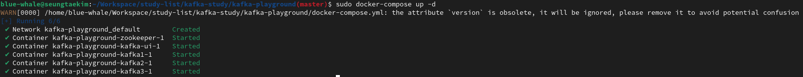
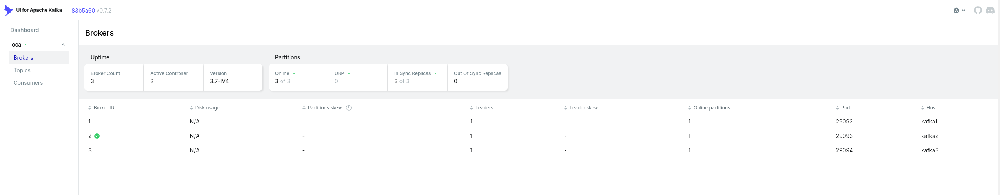
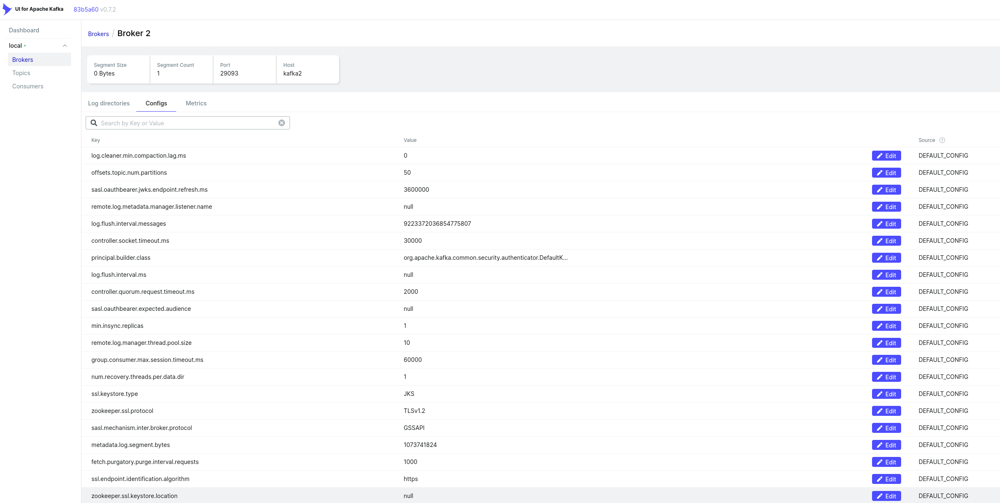
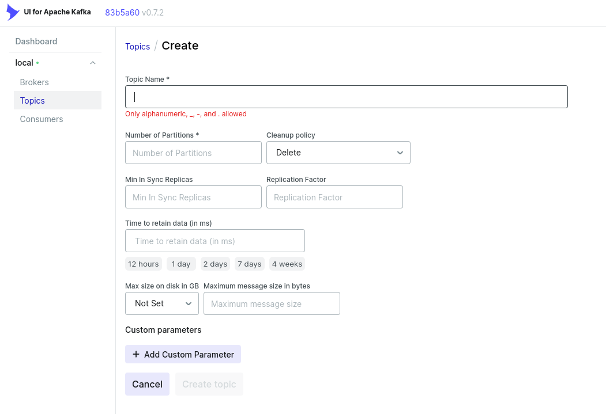

# Kafka Setup with Docker compose

## 1. How to Run

- Run the command below

```bash
> docker-compose up -d
```

- the result will be shown like the image below.





## 2. Basic Function of Kafka

- see broker info in the UI



- topic list


- topic create

