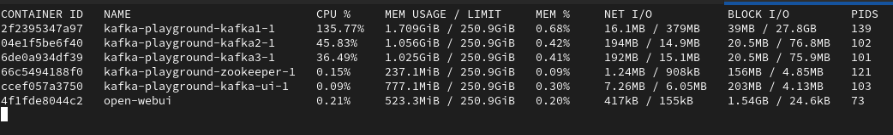

# Kafka Performance Test

## 2024.08.03

### 1. 성능 측정 방법

- 카프카 내장되어 있는 producer, consumer 성능 테스트 커맨드를 사용함.
- 현재 Docker-compose를 사용해 환경을 구축했으므로, 도커 내부로 접속해서 producer, consumer 커맨드 사용해야함.

```bash
docker-compose exec kafka1 bash
kafka-producer-perf-test --topic test-topic --num-records 1000000 --record-size 1000 --throughput 100000 --producer-props bootstrap.servers=kafka1:9092,kafka2:9092,kafka3:9092
kafka-consumer-perf-test --bootstrap-server kafka1:9092,kafka2:9092,kafka3:9092 --topic test-topic --messages 1000000
```

### 2. 성능 측정 결과

#### 2.1 커맨드 별 실행 옵션

- kafka-producer-perf-test 실행 시, 초기 옵션은 다음과 같이 설정했음

- 결과적으로 초당 레코드 처리량은 83,305 정도이고, 초당 80MB 정도의 처리량을 보여줌.

```bash

--num-records 1000000

의미: 총 생성할 레코드(메시지)의 수
설명: 이 테스트에서는 총 1,000,000개의 메시지를 생성하여 Kafka에 전송


--record-size 1000

의미: 각 레코드(메시지)의 크기 (바이트 단위)
설명: 각 메시지의 크기를 1,000바이트로 설정. 이는 페이로드의 크기를 의미하며, 실제 전송되는 데이터의 양을 결정함.


--throughput 100000

의미: 목표 처리량 (초당 메시지 수)
설명: 테스트는 초당 100,000개의 메시지를 전송하려고 시도함. 이는 최대 처리량을 의미하며, 실제 처리량은 시스템 성능에 따라 이보다 낮을 수 있습니다.

[appuser@2f2395347a97 ~]$ kafka-producer-perf-test --topic test-topic --num-records 1000000 --record-size 1000 --throughput 100000 --producer-props bootstrap.servers=kafka1:9092,kafka2:9092,kafka3:9092
395953 records sent, 79190.6 records/sec (75.52 MB/sec), 360.9 ms avg latency, 464.0 ms max latency.
433248 records sent, 86649.6 records/sec (82.64 MB/sec), 378.0 ms avg latency, 486.0 ms max latency.
1000000 records sent, 83305.564812 records/sec (79.45 MB/sec), 370.92 ms avg latency, 486.00 ms max latency, 374 ms 50th, 454 ms 95th, 481 ms 99th, 485 ms 99.9th.
```

- 여기서 record-size를 1,000 바이트에서 10,000 바이트 (즉, 레코드 하나 당 1MB)로 늘리면 성능이 1/2로 줄어듦.

```bash
[appuser@2f2395347a97 ~]$ kafka-producer-perf-test --topic test-topic --num-records 1000000 --record-size 10000 --throughput 100000 --producer-props bootstrap.servers=kafka1:9092,kafka2:9092,kafka3:9092
22004 records sent, 4400.8 records/sec (41.97 MB/sec), 405.7 ms avg latency, 552.0 ms max latency.
20399 records sent, 4079.8 records/sec (38.91 MB/sec), 502.7 ms avg latency, 551.0 ms max latency.
20269 records sent, 4053.8 records/sec (38.66 MB/sec), 505.1 ms avg latency, 605.0 ms max latency.
21324 records sent, 4264.8 records/sec (40.67 MB/sec), 481.4 ms avg latency, 555.0 ms max latency.
19904 records sent, 3980.8 records/sec (37.96 MB/sec), 513.3 ms avg latency, 570.0 ms max latency.
21475 records sent, 4295.0 records/sec (40.96 MB/sec), 477.0 ms avg latency, 576.0 ms max latency.
...
20866 records sent, 4173.2 records/sec (39.80 MB/sec), 488.9 ms avg latency, 535.0 ms max latency.
1000000 records sent, 4077.920913 records/sec (38.89 MB/sec), 500.98 ms avg latency, 614.00 ms max latency, 508 ms 50th, 558 ms 95th, 575 ms 99th, 604 ms 99.9th.
```

- 문제는 docker stat으로 리소스 사용량을 확인해보면, 브로커 1번에서만 리소스를 가져가 사용하는 것을 확인할 수 있음.


- 이에 대해 원인을 파악하던 중, Claude.ai에 문의한 결과는 아래와 같고, 커맨드 옵션을 조정하니, 3개 브로커에 정상적으로 작업 분배가 되었음.

```bash
kafka-producer-perf-test --topic test-topic --num-records 333333 --record-size 1000 --throughput 33333 --producer-props bootstrap.servers=kafka1:9092,kafka2:9092,kafka3:9092
```




- `Throughput` 이 커질 수록 Overhead + Latency도 같이 커짐.

```bash
[appuser@3e3208798dd6 ~]$ kafka-producer-perf-test --topic test-topic --num-records 1000000 --record-size 1000000 --throughput 2000 --producer-props bootstrap.servers=kafka1:9092,kafka2:9092,kafka3:9092
1815 records sent, 362.9 records/sec (346.11 MB/sec), 5.0 ms avg latency, 289.0 ms max latency.
1979 records sent, 395.8 records/sec (377.46 MB/sec), 3.6 ms avg latency, 12.0 ms max latency.
1993 records sent, 398.5 records/sec (380.06 MB/sec), 3.6 ms avg latency, 11.0 ms max latency.
1997 records sent, 399.3 records/sec (380.82 MB/sec), 3.4 ms avg latency, 9.0 ms max latency.
1947 records sent, 389.3 records/sec (371.29 MB/sec), 10.1 ms avg latency, 159.0 ms max latency.
1885 records sent, 376.8 records/sec (359.39 MB/sec), 21.0 ms avg latency, 202.0 ms max latency.
1989 records sent, 397.7 records/sec (379.30 MB/sec), 4.3 ms avg latency, 30.0 ms max latency.
1971 records sent, 394.0 records/sec (375.79 MB/sec), 3.6 ms avg latency, 16.0 ms max latency.
1994 records sent, 398.6 records/sec (380.17 MB/sec), 3.4 ms avg latency, 10.0 ms max latency.
1975 records sent, 395.0 records/sec (376.70 MB/sec), 3.4 ms avg latency, 11.0 ms max latency.
```