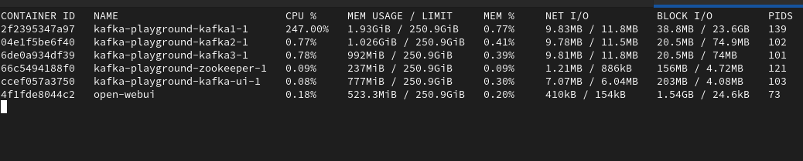
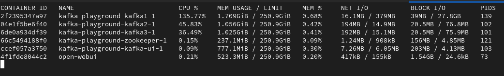
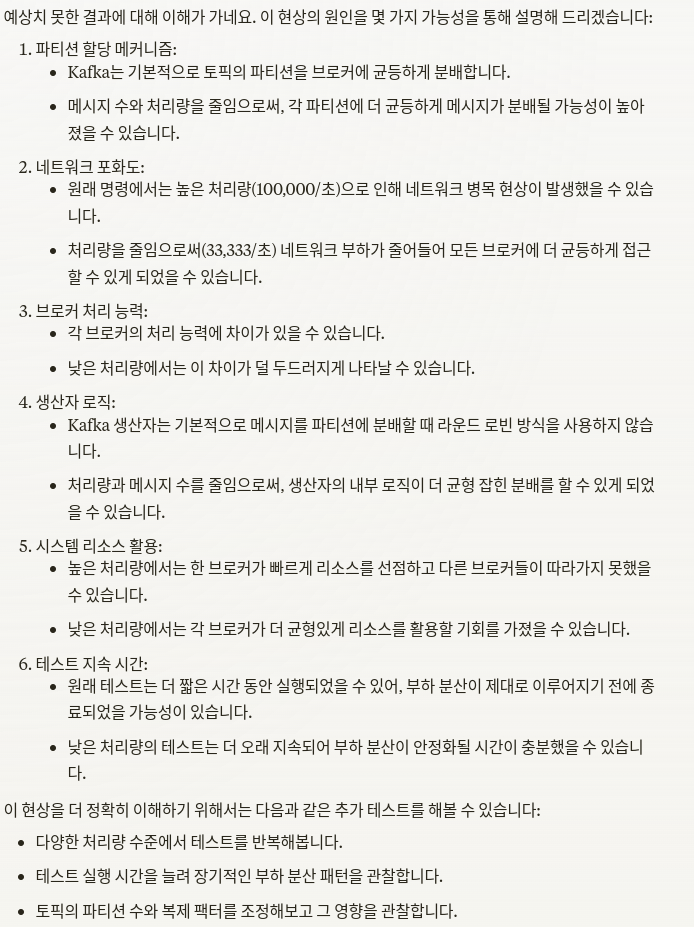

# Kafka Performance Test

## 2024.08.03

### 1. 성능 측정 방법

- 카프카 내장되어 있는 producer, consumer 성능 테스트 커맨드를 사용함.
- 현재 Docker-compose를 사용해 환경을 구축했으므로, 도커 내부로 접속해서 producer, consumer 커맨드 사용해야함.

```bash
docker-compose exec kafka1 bash
kafka-producer-perf-test --topic test-topic --num-records 1000000 --record-size 1000 --throughput 100000 --producer-props bootstrap.servers=kafka1:9092,kafka2:9092,kafka3:9092
kafka-consumer-perf-test --bootstrap-server kafka1:9092,kafka2:9092,kafka3:9092 --topic test-topic --messages 1000000
```

### 2. 성능 측정 결과

#### 2.1 커맨드 별 실행 옵션

- kafka-producer-perf-test 실행 시, 초기 옵션은 다음과 같이 설정했음

- 결과적으로 초당 레코드 처리량은 83,305 정도이고, 초당 80MB 정도의 처리량을 보여줌.

```bash

--num-records 1000000

의미: 총 생성할 레코드(메시지)의 수
설명: 이 테스트에서는 총 1,000,000개의 메시지를 생성하여 Kafka에 전송


--record-size 1000

의미: 각 레코드(메시지)의 크기 (바이트 단위)
설명: 각 메시지의 크기를 1,000바이트로 설정. 이는 페이로드의 크기를 의미하며, 실제 전송되는 데이터의 양을 결정함.


--throughput 100000

의미: 목표 처리량 (초당 메시지 수)
설명: 테스트는 초당 100,000개의 메시지를 전송하려고 시도함. 이는 최대 처리량을 의미하며, 실제 처리량은 시스템 성능에 따라 이보다 낮을 수 있습니다.

[appuser@2f2395347a97 ~]$ kafka-producer-perf-test --topic test-topic --num-records 1000000 --record-size 1000 --throughput 100000 --producer-props bootstrap.servers=kafka1:9092,kafka2:9092,kafka3:9092
395953 records sent, 79190.6 records/sec (75.52 MB/sec), 360.9 ms avg latency, 464.0 ms max latency.
433248 records sent, 86649.6 records/sec (82.64 MB/sec), 378.0 ms avg latency, 486.0 ms max latency.
1000000 records sent, 83305.564812 records/sec (79.45 MB/sec), 370.92 ms avg latency, 486.00 ms max latency, 374 ms 50th, 454 ms 95th, 481 ms 99th, 485 ms 99.9th.
```

- 여기서 record-size를 1,000 바이트에서 10,000 바이트 (즉, 레코드 하나 당 1MB)로 늘리면 성능이 1/2로 줄어듦.

```bash
[appuser@2f2395347a97 ~]$ kafka-producer-perf-test --topic test-topic --num-records 1000000 --record-size 10000 --throughput 100000 --producer-props bootstrap.servers=kafka1:9092,kafka2:9092,kafka3:9092
22004 records sent, 4400.8 records/sec (41.97 MB/sec), 405.7 ms avg latency, 552.0 ms max latency.
20399 records sent, 4079.8 records/sec (38.91 MB/sec), 502.7 ms avg latency, 551.0 ms max latency.
20269 records sent, 4053.8 records/sec (38.66 MB/sec), 505.1 ms avg latency, 605.0 ms max latency.
21324 records sent, 4264.8 records/sec (40.67 MB/sec), 481.4 ms avg latency, 555.0 ms max latency.
19904 records sent, 3980.8 records/sec (37.96 MB/sec), 513.3 ms avg latency, 570.0 ms max latency.
21475 records sent, 4295.0 records/sec (40.96 MB/sec), 477.0 ms avg latency, 576.0 ms max latency.
20137 records sent, 4027.4 records/sec (38.41 MB/sec), 510.3 ms avg latency, 569.0 ms max latency.
20018 records sent, 4003.6 records/sec (38.18 MB/sec), 509.2 ms avg latency, 565.0 ms max latency.
20330 records sent, 4066.0 records/sec (38.78 MB/sec), 506.1 ms avg latency, 576.0 ms max latency.
19420 records sent, 3884.0 records/sec (37.04 MB/sec), 524.5 ms avg latency, 566.0 ms max latency.
20583 records sent, 4116.6 records/sec (39.26 MB/sec), 501.5 ms avg latency, 578.0 ms max latency.
21939 records sent, 4387.8 records/sec (41.85 MB/sec), 464.3 ms avg latency, 575.0 ms max latency.
19773 records sent, 3954.6 records/sec (37.71 MB/sec), 522.1 ms avg latency, 576.0 ms max latency.
20146 records sent, 4029.2 records/sec (38.43 MB/sec), 502.9 ms avg latency, 589.0 ms max latency.
19529 records sent, 3905.8 records/sec (37.25 MB/sec), 525.2 ms avg latency, 592.0 ms max latency.
19776 records sent, 3955.2 records/sec (37.72 MB/sec), 520.7 ms avg latency, 571.0 ms max latency.
20809 records sent, 4161.8 records/sec (39.69 MB/sec), 489.7 ms avg latency, 555.0 ms max latency.
20304 records sent, 4060.8 records/sec (38.73 MB/sec), 506.2 ms avg latency, 564.0 ms max latency.
20915 records sent, 4183.0 records/sec (39.89 MB/sec), 491.1 ms avg latency, 575.0 ms max latency.
20142 records sent, 4028.4 records/sec (38.42 MB/sec), 506.3 ms avg latency, 575.0 ms max latency.
21093 records sent, 4218.6 records/sec (40.23 MB/sec), 488.1 ms avg latency, 574.0 ms max latency.
21168 records sent, 4233.6 records/sec (40.37 MB/sec), 486.9 ms avg latency, 552.0 ms max latency.
19908 records sent, 3981.6 records/sec (37.97 MB/sec), 512.1 ms avg latency, 560.0 ms max latency.
19884 records sent, 3976.8 records/sec (37.93 MB/sec), 515.4 ms avg latency, 598.0 ms max latency.
20526 records sent, 4105.2 records/sec (39.15 MB/sec), 499.9 ms avg latency, 542.0 ms max latency.
20202 records sent, 4040.4 records/sec (38.53 MB/sec), 506.5 ms avg latency, 548.0 ms max latency.
21126 records sent, 4225.2 records/sec (40.29 MB/sec), 485.5 ms avg latency, 579.0 ms max latency.
19846 records sent, 3969.2 records/sec (37.85 MB/sec), 513.8 ms avg latency, 550.0 ms max latency.
19597 records sent, 3919.4 records/sec (37.38 MB/sec), 521.3 ms avg latency, 578.0 ms max latency.
20079 records sent, 4015.8 records/sec (38.30 MB/sec), 512.0 ms avg latency, 563.0 ms max latency.
19817 records sent, 3963.4 records/sec (37.80 MB/sec), 519.8 ms avg latency, 571.0 ms max latency.
19448 records sent, 3889.6 records/sec (37.09 MB/sec), 523.3 ms avg latency, 560.0 ms max latency.
21616 records sent, 4323.2 records/sec (41.23 MB/sec), 481.4 ms avg latency, 550.0 ms max latency.
20003 records sent, 4000.6 records/sec (38.15 MB/sec), 502.8 ms avg latency, 574.0 ms max latency.
20158 records sent, 4031.6 records/sec (38.45 MB/sec), 510.4 ms avg latency, 574.0 ms max latency.
20731 records sent, 4146.2 records/sec (39.54 MB/sec), 493.6 ms avg latency, 539.0 ms max latency.
20885 records sent, 4177.0 records/sec (39.83 MB/sec), 489.7 ms avg latency, 559.0 ms max latency.
21661 records sent, 4332.2 records/sec (41.32 MB/sec), 476.1 ms avg latency, 552.0 ms max latency.
20277 records sent, 4055.4 records/sec (38.68 MB/sec), 501.4 ms avg latency, 557.0 ms max latency.
19230 records sent, 3846.0 records/sec (36.68 MB/sec), 533.1 ms avg latency, 614.0 ms max latency.
19996 records sent, 3999.2 records/sec (38.14 MB/sec), 511.1 ms avg latency, 572.0 ms max latency.
20068 records sent, 4013.6 records/sec (38.28 MB/sec), 512.4 ms avg latency, 572.0 ms max latency.
21194 records sent, 4238.8 records/sec (40.42 MB/sec), 482.8 ms avg latency, 556.0 ms max latency.
19607 records sent, 3921.4 records/sec (37.40 MB/sec), 522.3 ms avg latency, 561.0 ms max latency.
20043 records sent, 4008.6 records/sec (38.23 MB/sec), 516.5 ms avg latency, 571.0 ms max latency.
21000 records sent, 4200.0 records/sec (40.05 MB/sec), 483.5 ms avg latency, 556.0 ms max latency.
20103 records sent, 4020.6 records/sec (38.34 MB/sec), 508.8 ms avg latency, 562.0 ms max latency.
20048 records sent, 4009.6 records/sec (38.24 MB/sec), 513.8 ms avg latency, 563.0 ms max latency.
20866 records sent, 4173.2 records/sec (39.80 MB/sec), 488.9 ms avg latency, 535.0 ms max latency.
1000000 records sent, 4077.920913 records/sec (38.89 MB/sec), 500.98 ms avg latency, 614.00 ms max latency, 508 ms 50th, 558 ms 95th, 575 ms 99th, 604 ms 99.9th.
```

- 문제는 docker stat으로 리소스 사용량을 확인해보면, 브로커 1번에서만 리소스를 가져가 사용하는 것을 확인할 수 있음.



- 이에 대해 원인을 파악하던 중, Claude.ai에 문의한 결과는 아래와 같고, 커맨드 옵션을 조정하니, 3개 브로커에 정상적으로 작업 분배가 되었음.

```bash
kafka-producer-perf-test --topic test-topic --num-records 333333 --record-size 1000 --throughput 33333 --producer-props bootstrap.servers=kafka1:9092,kafka2:9092,kafka3:9092
```




